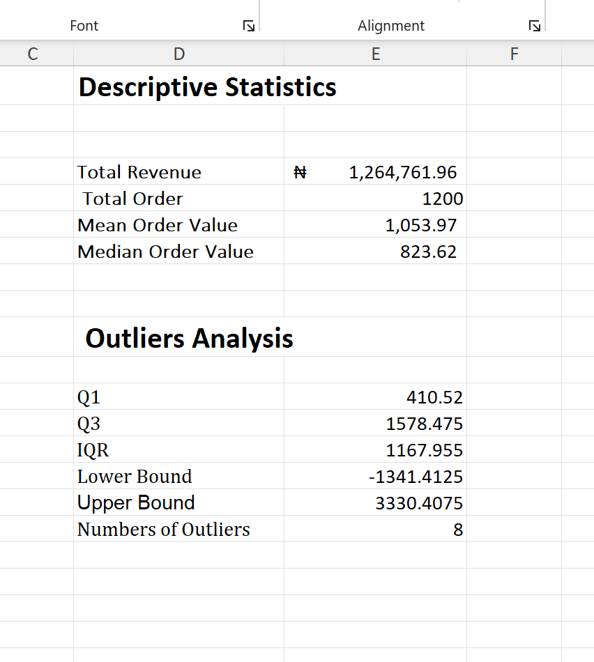
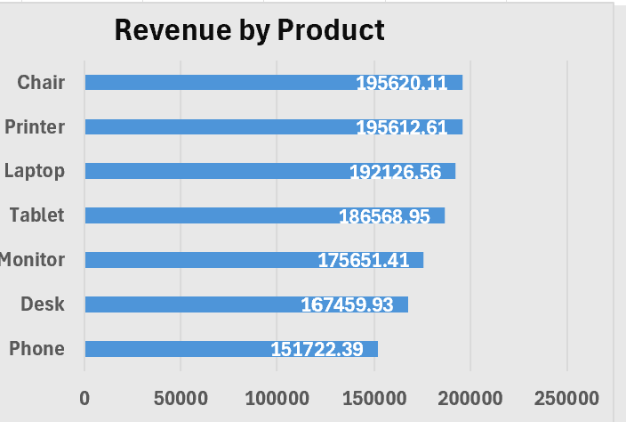
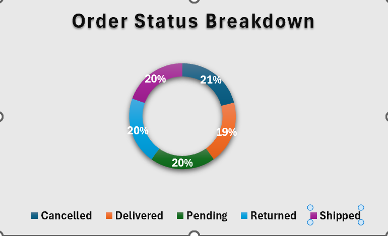
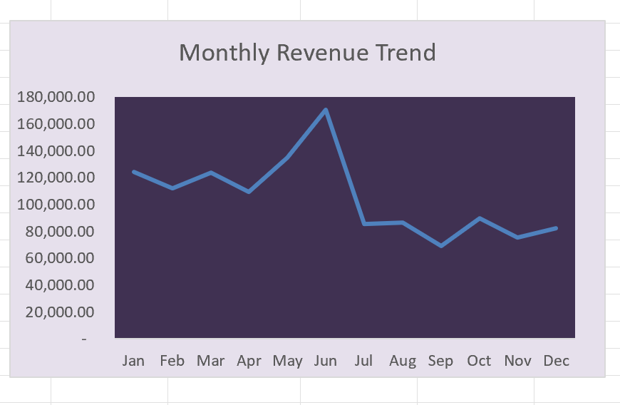
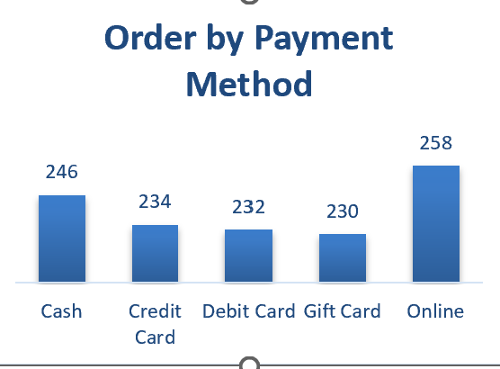
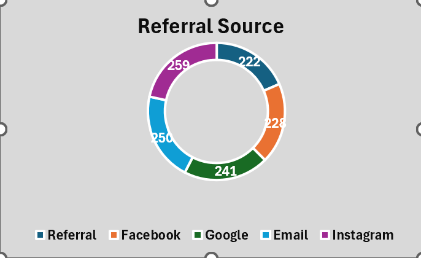

# DecodeLabs Task 2 - EDA Analysis

## Overview
Exploratory Data Analysis performed on a cleaned 
e-commerce order dataset using Microsoft Excel.

## Key Metrics
- Total Revenue: $1,264,761.96
- Average Order Value: $1,053.97
- Median Order Value: $823.62
- Total Orders: 1,200
- Outliers Detected: 8

## Key Findings
- Chair and Printer are the top revenue products
- 41.4% of orders were cancelled or returned
- June recorded the highest monthly revenue
- Instagram is the top customer acquisition channel

## Analysis Results

> Count, Mean and Median calculated for key columns.

> Chair and Printer lead with approximately $195,000 each.

> Cancelled and Returned orders make up 41.4% combined.

> June is the strongest month. September is the weakest.

> Online payment is the most used method with 258 orders.

> Instagram brought in the most customers at 259.

## Tools Used
- Microsoft Excel
- Pivot Tables
- Excel Formulas
